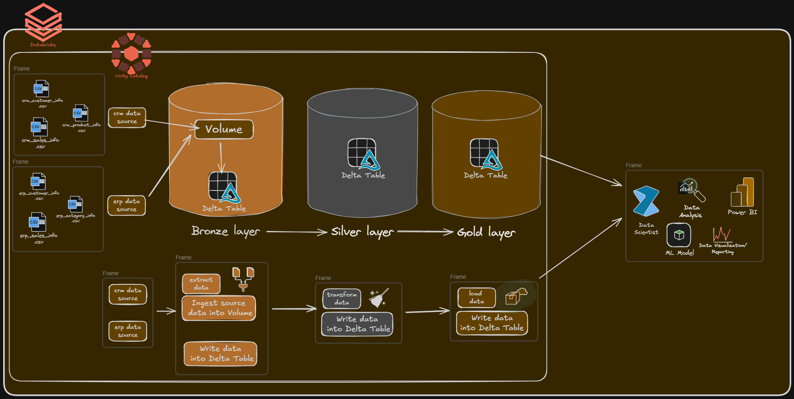
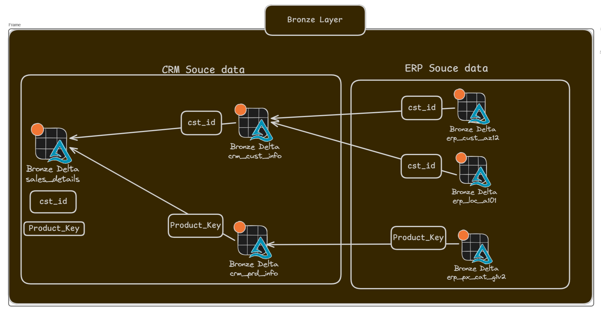

👩‍💻 I'm currently working on...

## *Simple DataBricks Project*

#### *Architecture*  
*This project follows the Medallion Architecture:*

A. Bronze Layer:  
- Raw data ingestion  
- Schema inference and storage as Delta tables  

B. Silver Layer:  
- Data cleaning and standardization  
- Type casting and validation  

C. Gold Layer:  
- Dimensional Data Model (Business Transformation)  
- Ready for BI and analysis  

---

### *Project Map*

###### *Bronze_layer Map*

----
## *Feedback*

*If you have any feedback, please reach out to us at omars.soub@gmail.com*

## 🔗 Links

[*my github page-https://github.com/omars1234*](https://github.com/omars1234)

## *🛠 Skills*
*Python, R, SQL ,PowerBi ,Tableaue*